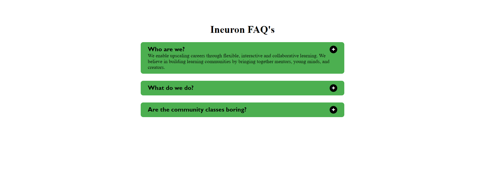

# JavaScript Project - Accordion

## **Project: Accordion**

### Concepts learned from this project:
- Learned about Selecting, Creating, Appending Elements with JavaScript
- Adding Styles to the Elements and Toggling styles with toggle() and adding eventlistener to elements using JavaScript. 

**Live Link :** [Deployed Link](https://js-project-accordion.netlify.app/)
>### Preview :
